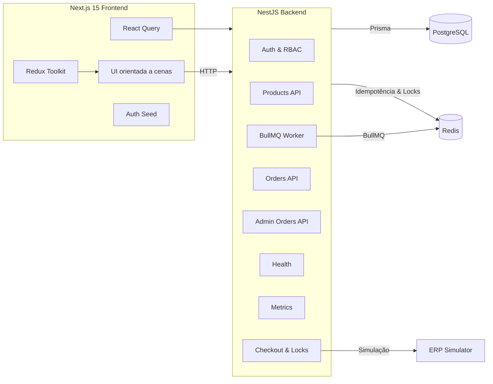
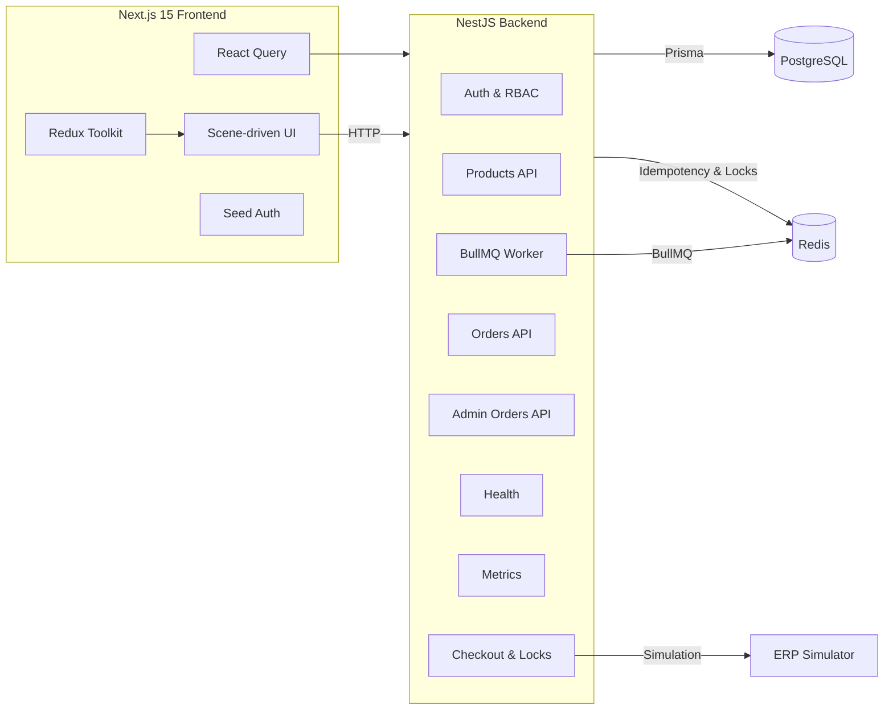

# CaseCellShop Checkout Service

Plataforma fullstack para checkout resiliente da CaseCellShop, desacoplando o ERP legado com APIs próprias, caching inteligente e UX responsiva.

## 📋 Desafio / Challenge Brief

### 🇧🇷 Descrição em Português

<details>
<summary><strong>Ver Detalhes</strong></summary>

**Contexto**
- A CaseCellShop enfrenta hiper crescimento e depende de um ERP monolítico para vitrine e checkout.
- Problemas principais: vitrine lenta, overselling e timeouts no checkout.

**Objetivo do Case**
- Reduzir a dependência direta do ERP, melhorar a experiência do cliente e evitar vendas sem estoque com uma solução incremental.

**Escopo do Desafio**
- Implementar fluxo completo de checkout para capinhas: listar produtos, escolher quantidade e tentar finalizar a compra.
- Tratar sucesso, validação, estoque insuficiente, tentativa duplicada e falha temporária do ERP.
- Exigir idempotência simples, simulação de ERP instável e UI com feedbacks claros.

**Critérios de Avaliação**
- APIs claras para catálogo e checkout, validações sólidas e prevenção de overselling.
- Testes automatizados ou estratégia de QA descrita.
- README detalhado; bônus com logs estruturados, endpoint de status e observabilidade.
- Ao entregar oficialmente, publique o repositório em uma conta GitHub pessoal e inclua o link na resposta final (Parte 1.B).

**Endereçando os 3 Problemas Identificados**
| Problema | Solução implementada |
| Performance da vitrine | API própria `GET /products` desacoplada do ERP, com paginação e cache Redis; frontend utiliza React Query, skeletons e invalidação inteligente para exibir resultados em milissegundos mesmo sob carga. |
| Consistência de estoque | Checkout executa reservas transacionais com Prisma, usa locks Redis para exclusão mútua e exige cabeçalho `Idempotency-Key`, garantindo que nenhum item seja vendido duas vezes e que respostas duplicadas sejam reaproveitadas. |
| Resiliência do checkout | Pedido é persistido e respondido imediatamente, enquanto a sincronização com o ERP ocorre via BullMQ com circuit breaker e retries controlados; o status pode ser acompanhado em `/orders/:id`, permitindo UX consistente mesmo quando o ERP falha. |

**Objetivo de Evolução**
- A solução reduz o acoplamento ao ERP central isolando vitrine e checkout, permitindo evolução incremental com filas, cache e observabilidade já prontas para escalar.

</details>

### 🇺🇸 English Description

<details>
<summary><strong>View Details</strong></summary>

**Context**
- CaseCellShop is scaling fast while relying on a monolithic ERP for catalog and checkout.
- Pain points: slow storefront, inventory overselling, and checkout timeouts.

**Goal**
- Gradually decouple the ERP, improve customer experience, and avoid stock issues through an incremental solution.

**Challenge Scope**
- Build an end-to-end checkout for phone cases: list products, select quantity, and submit the purchase.
- Handle success, validation errors, insufficient stock, duplicated attempts, and temporary ERP failures.
- Provide simple idempotency, ERP latency simulation, and user-facing feedback for each outcome.

**Evaluation Criteria**
- Clear APIs, strong validation, and overselling protection.
- Documented automated tests or QA strategy.
- Comprehensive README; bonus points for structured logs, status endpoints, and observability.
- When submitting officially, publish the repo under your GitHub account and include the public link in the final response (Part 1.B).

**Addressing the 3 Identified Problems**
| Problem | Implemented solution |
| Storefront performance | A dedicated `GET /products` API decouples the storefront from the ERP, serving paginated results cached in Redis; the frontend leverages React Query, skeleton states, and smart revalidation to keep responses fast under heavy load. |
| Inventory consistency | Checkout workflows run transactional reservations via Prisma, enforce Redis locks for mutual exclusion, and require an `Idempotency-Key` header so duplicate attempts reuse the same response—eliminating overselling scenarios. |
| Checkout resilience | Orders persist and return immediately while BullMQ handles ERP synchronization with circuit breaker plus controlled retries; clients can track the process through `/orders/:id`, ensuring consistent UX even when the ERP misbehaves. |

**Evolution Goal**
- The architecture decouples the ERP from critical journeys, enabling incremental improvements through queues, caching, and observability already built into the stack.

</details>

## 🇧🇷 Descrição em Português

<details>
<summary><strong>Ver Detalhes</strong></summary>

### Visão Geral
- Mini-projeto fullstack que protege o fluxo de compras contra lentidão do ERP original.
- Produtos, estoques e pedidos são expostos por APIs próprias enquanto a sincronização com o ERP ocorre de forma assíncrona.
- Frontend Next.js orientado a experiências (FSD) com feedbacks claros para cada resultado do checkout.

### Arquitetura


### Destaques da Solução
- DDD + Clean Architecture (domain, application, infrastructure, presentation).
- Idempotência com Redis e locks distribuídos para evitar overselling.
- Queue BullMQ, circuit breaker distribuído e simulador de ERP com latência configurável.
- Observabilidade: Pino estruturado, métricas Prometheus, spans OpenTelemetry.
- Frontend FSD com Tailwind, Framer Motion e proteção contra cliques múltiplos.
- Painel `/admin` para operadores acompanharem status dos pedidos.

### Guia de Execução Rápida
- Pré-requisitos: Node.js 20+, npm 9+, Docker + Docker Compose.
- Configuração de variáveis:
  ```bash
  cp backend/.env.example backend/.env
  cp frontend/.env.example frontend/.env.local
  ```
- Backend (modo dev):
  ```bash
  cd backend
  npm install
  npm run prisma:generate
  npm run prisma:migrate
  npm run prisma:seed
  npm run start:dev
  ```
  Serviços: API <http://localhost:3001/api/v1>, Swagger `/docs`, métricas `/metrics`.
- Frontend (modo dev):
  ```bash
  cd frontend
  npm install
  npm run dev
  ```
  UI em <http://localhost:3000>.
- Docker Compose:
  ```bash
  docker compose up --build
  ```
  Provisiona Postgres, Redis, backend e frontend prontos para uso.
- Documentação Swagger: <http://localhost:3001/docs/pt> e <http://localhost:3001/docs/en>

### Testes Automatizados
| Contexto | Comando |
|----------|---------|
| Backend (todos) | `npm test` |
| Backend unit | `npm run test:unit` |
| Backend integração | `npm run test:integration` |
| Backend e2e | `npm run test:e2e` |
| Frontend (todos) | `npm test` |
| Frontend unit | `npm run test:unit` |
| Frontend integração | `npm run test:integration` |
| Frontend e2e | `npm run test:e2e` |

### Fluxos Principais
1. Listagem de produtos com paginação, busca e skeletons.
2. Autenticação seed (admin/customer) com refresh tokens persistidos.
3. Checkout idempotente com respostas distintas para sucesso, validação, estoque, falha técnica e duplicidade.
4. Consulta de pedidos com status dinâmico (`PENDING`, `PROCESSING`, `SUCCESS`, `FAILED`).
5. Painel administrativo `/admin` com filtros por status e visão detalhada dos itens.

### Observabilidade & Resiliência
- Logs estruturados (Pino + rotating-file-stream) com contexto por requisição.
- Métricas Prometheus e spans OpenTelemetry para checkout e jobs do ERP.
- Rate limiting global com identificação por usuário/IP.
- Circuit breaker e retries controlados protegem integrações externas.

### Parte 1.A — Respostas Conceituais
1. **Reduzir dependência do ERP**: camada intermediária lê réplica de dados, publica APIs próprias e sincroniza o ERP de forma assíncrona.
2. **Consistência de estoque**: reservas atômicas em SQL + locks Redis evitam overselling mesmo sob concorrência.
3. **ERP instável**: fila BullMQ processa pedidos em background com retries e compensações.
4. **Idempotência simples**: cabeçalho `Idempotency-Key` persistido no Redis reaproveita respostas de tentativas anteriores.
5. **Organização para evoluir**: DDD e portas/adapters isolam regras e dependências.
6. **Próximos passos recomendados**: CDC para estoque, observabilidade distribuída, fila de compensação, rate limiting por conta e dashboards de conversão.

### Limitações Conhecidas
- Seeds usam dados fixos para usuários/produtos.
- Testes e2e dublam Redis/ERP; recomendável staging dedicado em produção.
- Simulador de ERP usa aleatoriedade — ajuste envs para cenários determinísticos.

### Próximos Passos Sugeridos
1. Sincronização assíncrona com ERP (implementado ✅).
2. Rate limiting e circuit breaker por usuário (implementado ✅).
3. Observabilidade distribuída (implementado ✅).
4. UI administrativa para operadores (implementado ✅).

</details>

## 🇺🇸 English Description

<details>
<summary><strong>View Details</strong></summary>

### Overview
- Fullstack mini-project that shields the checkout flow from the legacy ERP latency.
- Products, inventory and orders are exposed through our own APIs while ERP sync happens asynchronously.
- Next.js experience-first frontend with clear feedback for every checkout outcome.

### Architecture


### Solution Highlights
- DDD + Clean Architecture (domain, application, infrastructure, presentation).
- Redis-backed idempotency and distributed locks keep inventory consistent.
- BullMQ queue, distributed circuit breaker, and configurable ERP simulator.
- Observability: structured Pino logs, Prometheus metrics, OpenTelemetry spans.
- FSD-inspired frontend with Tailwind, Framer Motion, and guarded actions.
- `/admin` dashboard for operators to track orders and failure reasons.

### Quick Start
- Requirements: Node.js 20+, npm 9+, Docker + Docker Compose.
- Environment setup:
  ```bash
  cp backend/.env.example backend/.env
  cp frontend/.env.example frontend/.env.local
  ```
- Backend (dev mode):
  ```bash
  cd backend
  npm install
  npm run prisma:generate
  npm run prisma:migrate
  npm run prisma:seed
  npm run start:dev
  ```
  Services: API <http://localhost:3001/api/v1>, Swagger `/docs`, metrics `/metrics`.
- Frontend (dev mode):
  ```bash
  cd frontend
  npm install
  npm run dev
  ```
  UI served at <http://localhost:3000>.
- Docker Compose:
  ```bash
  docker compose up --build
  ```
  Provisions Postgres, Redis, backend and frontend ready to run.
- Swagger docs: <http://localhost:3001/docs/pt> and <http://localhost:3001/docs/en>

### Automated Tests
| Scope | Command |
|-------|---------|
| Backend – all | `npm test`
| Backend – unit | `npm run test:unit`
| Backend – integration | `npm run test:integration`
| Backend – e2e | `npm run test:e2e`
| Frontend – all | `npm test`
| Frontend – unit | `npm run test:unit`
| Frontend – integration | `npm run test:integration`
| Frontend – e2e | `npm run test:e2e`

### Core Flows
1. Product catalog with pagination, search and skeleton loading states.
2. Seed authentication (admin/customer) with persisted refresh tokens.
3. Checkout with transactional reservations, idempotent responses and detailed messaging.
4. Order tracking with live statuses (`PENDING`, `PROCESSING`, `SUCCESS`, `FAILED`).
5. Operator dashboard `/admin` featuring status filters and item breakdowns.

### Observability & Resilience
- Structured logging (Pino + rotating-file-stream) with per-request context.
- Prometheus metrics and OpenTelemetry spans for checkout and ERP workers.
- Global rate limiting with user/IP tracking.
- Circuit breaker plus controlled retries around external integrations.

### Conceptual Answers (Challenge 1.A)
1. **Reduce ERP coupling**: introduce a checkout service that reads replicated data and exposes its own APIs while syncing asynchronously.
2. **Inventory consistency**: atomic SQL reservations plus Redis locks prevent overselling under heavy load.
3. **Slow ERP handling**: queue work via BullMQ, respond immediately, and retry/compensate in the background.
4. **Simple idempotency**: accept `Idempotency-Key`, persist results in Redis, replay payloads on retries.
5. **Scalable organization**: DDD with ports/adapters isolates business rules from infrastructure.
6. **Next production steps**: CDC for products, distributed telemetry, compensation queue, per-account rate limiting, conversion dashboards.

### Known Limitations
- Seed data contains fixed users and products.
- E2E tests mock Redis/ERP; prefer dedicated staging services in production.
- ERP simulator relies on randomness—tune env vars for deterministic runs when needed.

### Suggested Next Steps
1. Async ERP synchronization (shipped ✅).
2. Per-user rate limiting and circuit breaker (shipped ✅).
3. Distributed observability (shipped ✅).
4. Operator-facing admin UI (shipped ✅).

</details>

---

- Documentação detalhada por camada: `backend/README.md` e `frontend/README.md`.
- Históricos de prompts registrados em `PROMPTS.md`.
